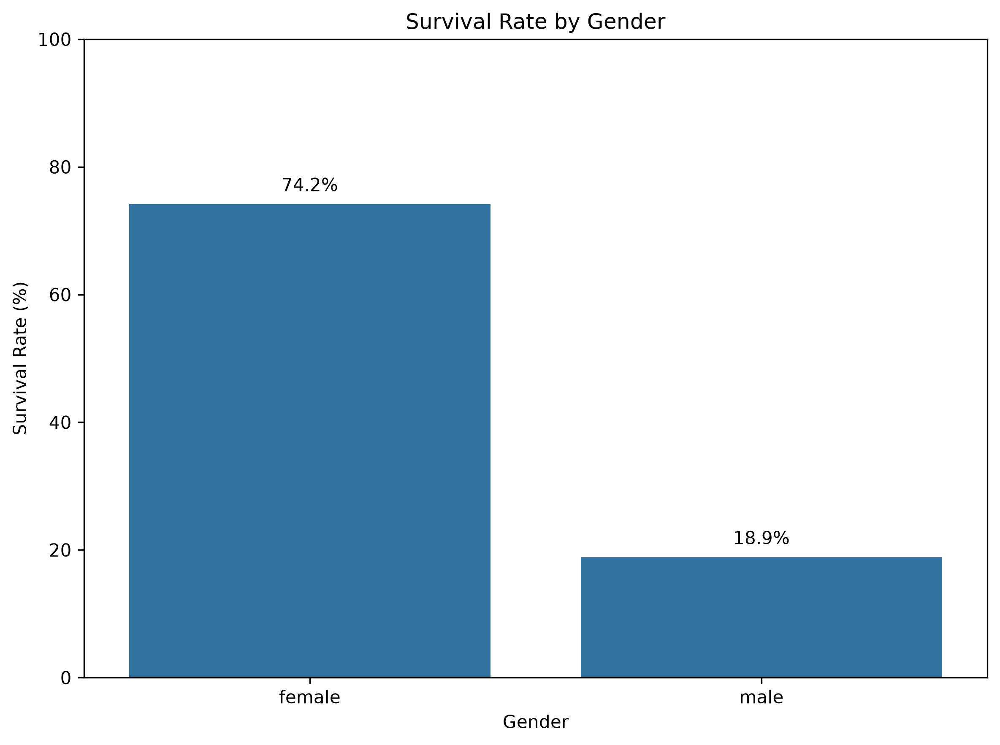
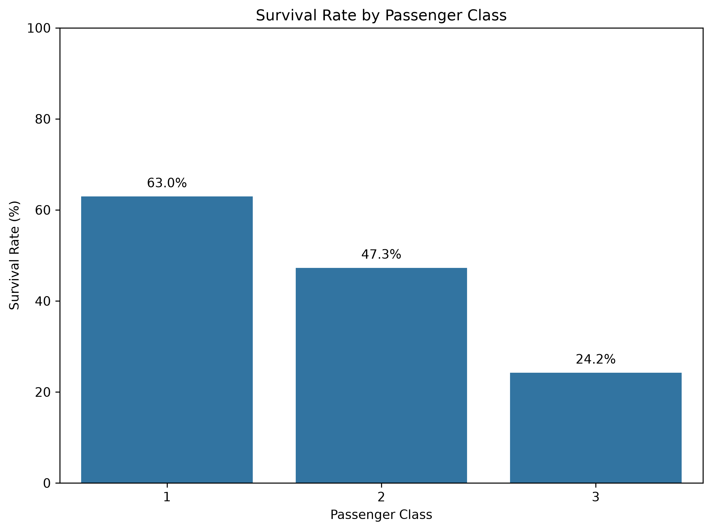
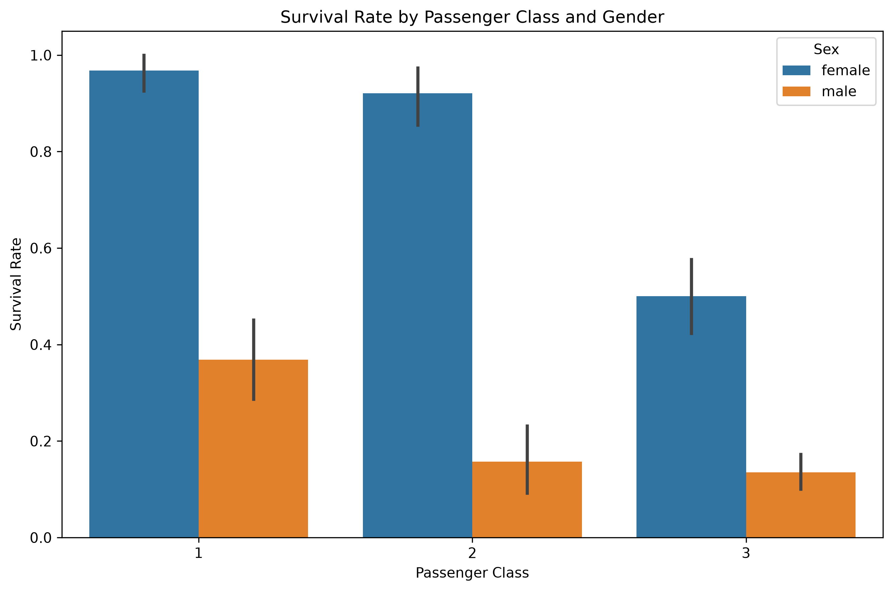
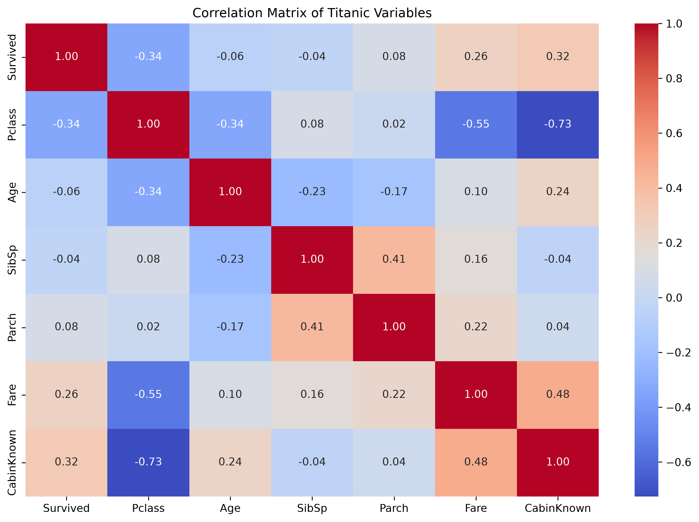

# Titanic-Data-Analysis  
⭐ My first Data-Analysis project of the Titanic dataset using Python, Pandas, NumPy and Matplotlib.
⭐ This is the first project of my life  about Data Analysis.
⭐ I have done with help of AI + My Creativity to Understand and Explore. 

---

## 📌 Project Overview

The sinking of the  Titanic is one of the most well-known maritime disasters in history. This project uses passenger-level data to explore patterns in survival and understand how factors such as **gender, passenger class, age, fare, family relationships, and embarkation port** were associated with survival outcomes.

The project covers data cleaning, preprocessing, exploratory data analysis, feature engineering, statistical relationships, and visualization using Python.

---

## 🎯 Objectives

The main objectives of this project were to:

* Clean and preprocess the Titanic dataset
* Identify and handle missing values
* Check for duplicate records
* Create useful features from existing data
* Analyze survival patterns across different passenger groups
* Study relationships between numerical variables
* Create clear visualizations to communicate findings
* Derive meaningful insights from the dataset

---

## 🗂️ Dataset

The dataset contains information about **891 Titanic passengers**.

### Main Features

| Feature       | Description                                       |
| ------------- | ------------------------------------------------- |
| `PassengerId` | Unique passenger identifier                       |
| `Survived`    | Survival status (0 = No, 1 = Yes)                 |
| `Pclass`      | Passenger class                                   |
| `Name`        | Passenger name                                    |
| `Sex`         | Passenger gender                                  |
| `Age`         | Passenger age                                     |
| `SibSp`       | Number of siblings/spouses aboard                 |
| `Parch`       | Number of parents/children aboard                 |
| `Ticket`      | Ticket number                                     |
| `Fare`        | Passenger fare                                    |
| `Cabin`       | Cabin information                                 |
| `Embarked`    | Port of embarkation                               |
| `CabinKnown`  | Indicates whether cabin information was available |

---

## 🧹 Data Cleaning

The dataset was inspected and cleaned before performing exploratory analysis.

The main preprocessing steps included:

* Checking the dataset structure
* Identifying missing values
* Handling missing age values
* Handling missing categorical information
* Creating the `CabinKnown` feature
* Checking for duplicate records
* Verifying the final dataset after cleaning

### Final Dataset

```text
Rows: 891
Columns: 12
Missing values after cleaning: 0
Duplicate rows after cleaning: 0
```

---

## 📊 Exploratory Data Analysis

Several analyses were performed to understand survival patterns.

### 1. Survival by Gender

Female passengers had a substantially higher survival rate than male passengers in the dataset.

* Female survival rate: **~74.2%**
* Male survival rate: **~18.9%**



---

### 2. Survival by Passenger Class

Passenger class was also strongly associated with survival.

* 1st Class: **~63.0%**
* 2nd Class: **~47.3%**
* 3rd Class: **~24.2%**



---

### 3. Survival by Age Group

Passengers were grouped into age categories to examine differences in survival across age groups.


---

### 4. Survival by Class and Gender

Combining passenger class and gender provides a more detailed view of how these variables were associated with survival.



---

### 5. Correlation Analysis

A correlation matrix was created to examine linear relationships between selected numerical variables.



For example, the correlation between `Survived` and `Pclass` was approximately **-0.34**, indicating a negative linear relationship between the class number and survival status.

> Correlation indicates association and does not by itself establish causation.

---

## 💡 Key Findings

The analysis revealed several important patterns:

1. **Gender was strongly associated with survival**, with female passengers having a much higher survival rate than male passengers.

2. **Passenger class was associated with survival**, with first-class passengers having a higher survival rate than second- and third-class passengers.

3. **Age groups showed different survival patterns**, suggesting that age was also relevant when examining passenger outcomes.

4. **Fare showed a positive relationship with survival**, which is partly consistent with the relationship between fare and passenger class.

5. The correlation analysis showed that the relationships between variables were generally not equally strong, highlighting the importance of examining multiple features rather than relying on a single variable.

---

## 🛠️ Technologies Used

* **Python**
* **Pandas**
* **NumPy**
* **Matplotlib**
* **Seaborn**

---

## 📁 Project Structure

```text
titanic-data-analysis/
│
├── data/
│   └── titanic.csv
|   └── requirements.txt
│
├── images/
│   ├── survival_by_age_group.png
|   ├── correlation_heatmap.png
|   ├── survival_by_class.png
│   ├── survival_by_gender.png
│   ├── survival_class_gender.png
│   
│
├── src/
│   └── titanic_analysis.py
│
|
└── README.md
```

---

## ▶️ How to Run

### 1. Clone the repository

```bash
git clone https://github.com/Aaryanpatil21/titanic-data-analysis.git
```

### 2. Navigate to the project

```bash
cd titanic-data-analysis
```

### 3. Install dependencies

```bash
pip install -r requirements.txt
```

### 4. Run the analysis

```bash
python src/titanic_analysis.py
```

The generated visualizations will be stored in the `images/` directory.

---

## 📚 What I Learned

Through this project, I practiced:

* Working with real-world datasets
* Data cleaning and preprocessing
* Handling missing values
* Feature engineering
* Group-based analysis using Pandas
* Correlation analysis
* Data visualization
* Interpreting analytical results
* Structuring a Python project for reproducibility
* Using Git and GitHub to document a project

---

## 🔮 Future Improvements

Potential improvements include:

* Building an interactive dashboard
* Performing statistical hypothesis testing
* Exploring additional feature engineering techniques
* Building a machine learning model to predict survival
* Comparing multiple classification algorithms
* Evaluating model performance using appropriate metrics

---

## 👨‍💻 Author

**Aaryan Patil**

B.Tech Computer Science Engineering Student
VIT Pune

[GitHub](https://github.com/Aaryanpatil21)

---

⭐ If you found this project useful, feel free to explore the repository and the analysis.

